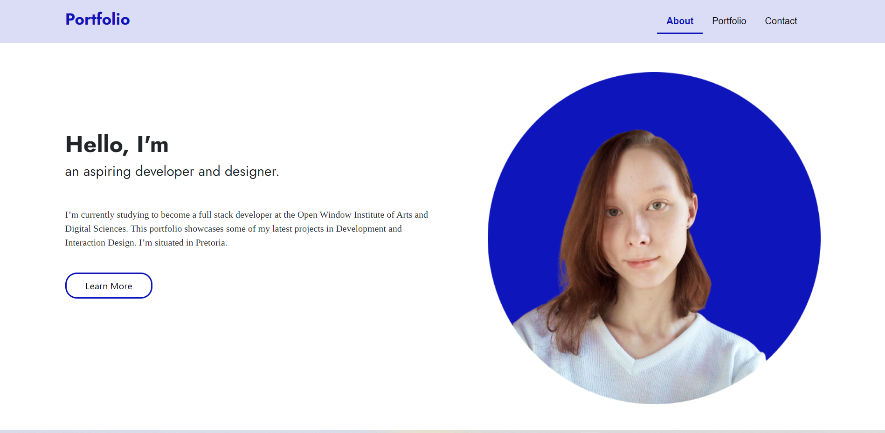

# Welcome to My Portfolio
### In this portfolio there are 3 sections. The about me section, the portfolio display, and the contact me section. It was smacked together in 3.5 seconds using bootstrap components. If you would like to use it for your portfolio go ahead. It's perfect for students... probably.

### Here's a screenshot of the site if you want to use it:

 

# **Getting Started**
* Login to your Github account.
* Create a fork of the code.
* Then, clone it to your device.
* Create a new branch and you're all set.
 

# **Built With:**
* HTML and CSS
* [Bootstrap CDN](https://www.bootstrapcdn.com/)
* Javascript
 

# **Contributing**
#### Some animations and more interactivity would be nice. I got tired. 
 

# **Author**
#### Celeste Van Tonder
 

# **License**
#### MIT License Agreement

 

# **Acknowledgements**
* [Bootstrap Icons](https://cdn.jsdelivr.net/npm/bootstrap-icons@1.10.5/font/bootstrap-icons.css)
* [Google Fonts](https://fonts.googleapis.com/css2?family=Jost:wght@400;700&family=Tinos&display=swap)
#### Huge thank you to bootstrap and google fonts. And thank you to my family for all your support. 
